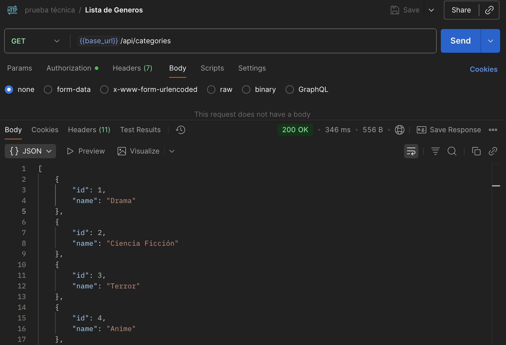
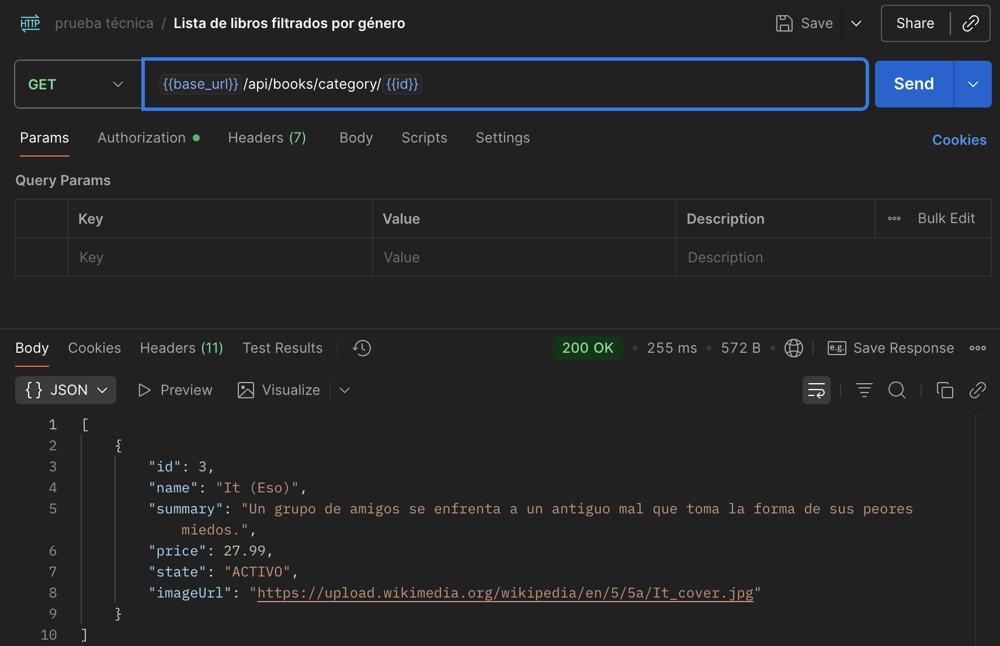
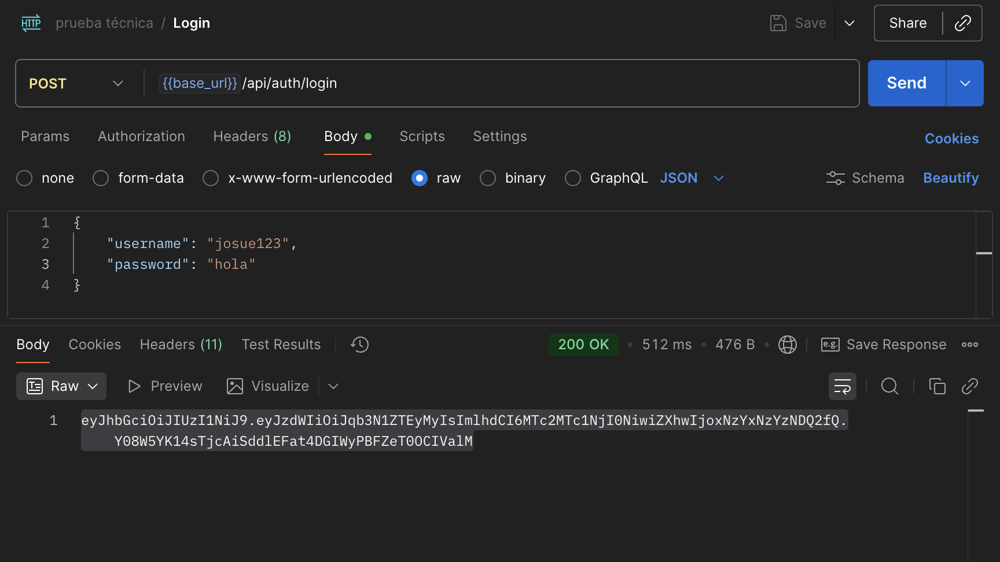
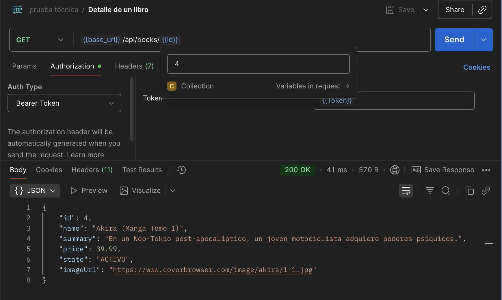
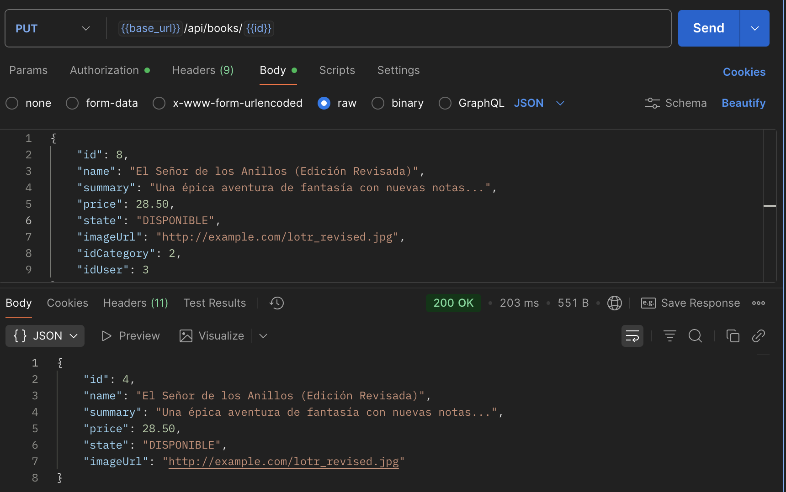

# Prueba Técnica - Sistema de Gestión de Libros

Este proyecto implementa un sistema básico de gestión de libros. 

## Tecnologías Clave

*   **Spring Boot**: Framework principal para la construcción de aplicaciones robustas y escalables.
*   **Spring Data JPA**: Abstracción para la capa de persistencia, facilitando la interacción con la base de datos.
*   **Hibernate**: Implementación de JPA utilizada para el mapeo objeto-relacional.
*   **Maven**: Herramienta estándar para la gestión de dependencias y el ciclo de vida de construcción del proyecto.
*   **Lombok**: Biblioteca para reducir el código repetitivo (boilerplate) mediante anotaciones.
*   **Spring Security**: Proporciona funcionalidades de autenticación y autorización, incluyendo soporte para JSON Web Tokens (JWT).
*   **MySQL**: Base de datos relacional utilizada para el almacenamiento persistente de datos.
*   **Jakarta Validation**: API para la validación de datos basada en anotaciones.

## Estructura del Proyecto

La estructura del proyecto sigue las convenciones de Spring Boot y Maven, organizando el código de manera modular y clara. A continuación, se detalla la organización dentro del paquete principal `com.edu.sv.pruebatecnica`:

```
.
├───src/
│   ├───main/
│   │   ├───java/
│   │   │   └───com/
│   │   │       └───edu/
│   │   │           └───sv/
│   │   │               └───pruebatecnica/
│   │   │                   ├───PruebaTecnicaApplication.java # Clase principal de la aplicación
│   │   │                   ├───controller/                     # Controladores REST para la API
│   │   │                   │   ├───request/                    # Objetos de Transferencia de Datos (DTOs) para solicitudes
│   │   │                   │   └───response/                   # DTOs para respuestas de la API
│   │   │                   ├───persistence/                    # Capa de persistencia (repositorios y entidades)
│   │   │                   │   └───domain/                     # Entidades de dominio mapeadas a la base de datos
│   │   │                   ├───security/                       # Componentes relacionados con la seguridad (JWT, filtros)
│   │   │                   └───service/                        # Capa de lógica de negocio
│   │   │                       ├───implementation/             # Implementaciones concretas de los servicios
│   │   │                       └───mapper/                     # Mappers para la conversión entre entidades y DTOs
│   │   └───resources/
│   │       └───application.properties                          # Archivo de configuración de la aplicación
│   └───test/                                                   # Pruebas unitarias y de integración
├───pom.xml                                                     # Archivo de configuración de Maven
└───README.md                                                   # Documentación del proyecto
```

## Endpoints de la API

A continuación, se detallan los endpoints clave expuestos por la aplicación, relevantes para la evaluación:

*   **a. Listar Géneros (Categorías)**
    *   `GET /api/categories`
    *   **Descripción:** Recupera una colección de todas las categorías de libros disponibles en el sistema.
    *   **Ejemplo de Respuesta (200 OK):**
        ```json
        [
            {
                "id": 1,
                "name": "Ficción"
            },
            {
                "id": 2,
                "name": "Ciencia Ficción"
            }
        ]
        ```

*   **b. Listar Libros por Género**
    *   `GET /api/books/category/{idCategory}`
    *   **Descripción:** Obtiene una lista de libros filtrados por el identificador de la categoría (género) proporcionado.
    *   **Parámetros de Ruta:**
        *   `idCategory` (Long): El ID único de la categoría.
    *   **Ejemplo de Respuesta (200 OK):**
        ```json
        [
            {
                "id": 101,
                "name": "El Señor de los Anillos",
                "summary": "Una épica aventura de fantasía...",
                "price": 25.00,
                "state": "DISPONIBLE",
                "imageUrl": "http://example.com/lotr.jpg"
            }
        ]
        ```

*   **c. Autenticación de Usuario (Login)**
    *   `POST /api/auth/login`
    *   **Descripción:** Permite a un usuario autenticarse en el sistema. Si las credenciales son válidas, devuelve un JSON Web Token (JWT) que debe ser utilizado para acceder a recursos protegidos.
    *   **Request Body:**
        ```json
        {
            "username": "string",
            "password": "string"
        }
        ```
    *   **Ejemplo de Respuesta (200 OK):**
        ```json
        "eyJhbGciOiJIUzI1NiIsInR5cCI6IkpXVCJ9..." // JWT Token
        ```

*   **d. Detalle de un Libro**
    *   `GET /api/books/{id}`
    *   **Descripción:** Recupera la información detallada de un libro específico utilizando su identificador único.
    *   **Parámetros de Ruta:**
        *   `id` (Long): El ID único del libro.
    *   **Ejemplo de Respuesta (200 OK):**
        ```json
        {
            "id": 101,
            "name": "El Señor de los Anillos",
            "summary": "Una épica aventura de fantasía...",
            "price": 25.00,
            "state": "DISPONIBLE",
            "imageUrl": "http://example.com/lotr.jpg"
        }
        ```

*   **e. Actualización de Información de un Libro**
    *   `PUT /api/books/{id}`
    *   **Descripción:** Actualiza los datos de un libro existente. Este endpoint requiere autenticación mediante un JWT válido en el encabezado `Authorization: Bearer <token>`.
    *   **Parámetros de Ruta:**
        *   `id` (Long): El ID único del libro a actualizar.
    *   **Request Body:**
        ```json
        {
            "name": "string",
            "summary": "string",
            "price": 0.0,
            "state": "string",
            "imageUrl": "string",
            "idCategory": 0,
            "idUser": 0
        }
        ```
    *   **Ejemplo de Respuesta (200 OK):**
        ```json
        {
            "id": 101,
            "name": "El Señor de los Anillos (Edición Revisada)",
            "summary": "Una épica aventura de fantasía con nuevas notas...",
            "price": 28.50,
            "state": "DISPONIBLE",
            "imageUrl": "http://example.com/lotr_revised.jpg"
        }
        ```

## Guía de Ejecución del Proyecto

### Prerrequisitos del Entorno

Para compilar y ejecutar la aplicación, asegúrese de tener instalados los siguientes componentes:

*   **Java Development Kit (JDK) 17 o superior**: Esencial para la compilación y ejecución del código Java.
*   **Apache Maven 3.6.0 o superior**: Utilizado para la gestión de dependencias, compilación y empaquetado del proyecto.

### Configuración de la Base de Datos MySQL

El proyecto está configurado para utilizar una base de datos MySQL. Antes de iniciar la aplicación, es necesario crear la base de datos y configurar las credenciales de acceso.

1.  **Creación de la Base de Datos:**
    Ejecute el siguiente comando SQL en su servidor MySQL para crear la base de datos `prueba-tecnica`:
    ```sql
    CREATE DATABASE prueba-tecnica;
    ```

2.  **Configuración de `application.properties`:**
    Edite el archivo `src/main/resources/application.properties` para reflejar la configuración de su instancia de MySQL. Un ejemplo de configuración es el siguiente:

    ```properties
    spring.datasource.url=jdbc:mysql://localhost:3306/prueba-tecnica?useSSL=false&serverTimezone=UTC
    spring.datasource.username=your_mysql_username
    spring.datasource.password=your_mysql_password
    spring.datasource.driver-class-name=com.mysql.cj.jdbc.Driver
    spring.jpa.hibernate.ddl-auto=update
    spring.jpa.show-sql=true
    spring.jpa.properties.hibernate.dialect=org.hibernate.dialect.MySQLDialect
    ```
    **Nota Importante:** Reemplace `your_mysql_username` y `your_mysql_password` con las credenciales de su usuario de MySQL.

### Pasos para la Ejecución

1.  **Clonar el Repositorio:**
    Si aún no lo ha hecho, clone el repositorio del proyecto.
2.  **Navegar al Directorio Raíz del Proyecto:**
    Abra una terminal y navegue hasta el directorio donde se encuentra el archivo `pom.xml`:
    ```bash
    cd /ruta/a/su/proyecto/prueba-tecnica
    ```
3.  **Compilar el Proyecto:**
    Utilice Maven para compilar el proyecto y resolver todas las dependencias:
    ```bash
    ./mvnw clean install
    ```
4.  **Iniciar la Aplicación Spring Boot:**
    Ejecute la aplicación utilizando el plugin de Spring Boot para Maven:
    ```bash
    ./mvnw spring-boot:run
    ```

Una vez iniciada, la aplicación estará accesible en `http://localhost:8080`.

## Demostración con Postman

A continuación, se muestra el funcionamiento de los 5 endpoints requeridos utilizando Postman.

### a. Listar Géneros (Categorías)
Se realiza una petición GET al endpoint /api/categories para obtener todas las categorías.



### b. Lista de Libros por Género
Se realiza una petición GET al endpoint /api/books/category/{idCategory} para filtrar los libros.



### c. Login (Sencillo)
Se realiza una petición POST al endpoint /api/auth/login con el username y password en el body para obtener el JWT.



### d. Detalle de un Libro
Se realiza una petición GET al endpoint /api/books/{id} para obtener un libro específico.


### e. Actualización de Información del Libro
Se realiza una petición PUT al endpoint /api/books/{id}, enviando el token JWT en la pestaña Authorization (Bearer Token) y los datos a actualizar en el body.



